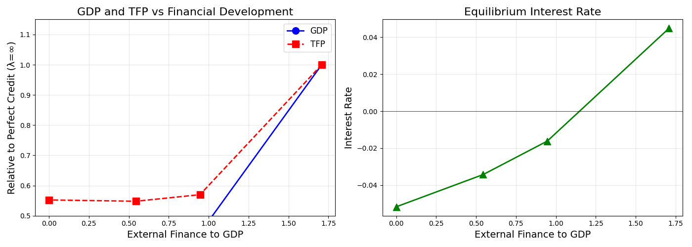

# Buera & Shin (2010/2013) JPE Replication

This repository contains a high-performance replication of **Buera & Shin (2013), "Financial Frictions and the Persistence of History: A Quantitative Exploration"**, published in the *Journal of Political Economy*.

## 🚀 Key Features
- **Spectral Collocation Solver**: Uses bivariate Chebyshev polynomials for extreme precision and speed.
- **Matrix-Vector Architecture**: Leverages BLAS-optimized tensor contractions ($T_a C T_z^T$).
- **Hybrid Stationary Distribution**: Built-in Analytical (Histogram) and Simulation (Monte Carlo) methods.
- **Warm-Start Power Iteration**: Rapid market-clearing for General Equilibrium prices.

## 📁 Repository Structure
- `main_spectral.py`: The state-of-the-art supercharged spectral solver (v6).
- `benchmark_vfi.py`: A robust Value Function Iteration (VFI) benchmark (v2) for verification.
- `shared_library/`: Vectorized utility functions for spectral basis recursion.
- `results/`: Output plots and Figure 2 replication results.

## 🛠 Usage
Ensure you have `numpy`, `scipy`, `matplotlib`, and `numba` installed.

### Run the Spectral Solver (Recommended)
```bash
python main_spectral.py --method analytical
```

### Run the VFI Benchmark
```bash
python benchmark_vfi.py
```

## 📊 Replication (Figure 2)
The spectral solver produces a 1x2 plot comparing GDP, TFP, and Interest Rates across different financial development regimes ($\lambda$).


